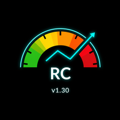

# RiskCockpit — Prop-Firm Risk-Monitoring Dashboard (MetaTrader 5)

**RiskCockpit** is a real-time, rule-monitoring dashboard for prop-firm traders. It watches your risk against the funding program's rules *while you trade* — so you don't blow a challenge on a careless click.

> **It is an advisor, not an autotrader.** RiskCockpit never opens, closes, or modifies a trade. Every decision stays in your hands — it only measures, warns, and displays.

## Features

- **Live risk read-out** — current exposure, open risk, and distance to your daily and overall loss limits, updated tick-by-tick.
- **Prop-firm rule profiles** — built-in challenge catalog (FundedNext Stellar 1-Step / 2-Step / Lite / Instant), and compatible with FTMO, E8, The5ers, MyFundedFX-style rules.
- **Lot sizer** — computes position size from your risk-per-trade and stop distance.
- **Drawdown guards** — daily loss and max drawdown tracking with clear on-chart warnings.
- **Optional Telegram alerts** — you supply your own bot token (nothing is hard-coded).
- **Multi-language UI** — EN / FR / ES.

## Install

1. Copy `Indicators/RiskCockpit.mq5` → `<MT5>/MQL5/Indicators/`
2. Copy `Libraries/*.mqh` → `<MT5>/MQL5/Libraries/`
3. In MetaEditor, open `RiskCockpit.mq5` and press **F7** to compile (0 errors).
4. Attach the indicator to a chart in MT5.

A compiled `RiskCockpit.ex5` is included for convenience.

## Availability

Published **free** on the MQL5 Market. More at **[javadrazavi.fr](https://javadrazavi.fr)**.

## Author

**Javad Razavi** — *The Solution Maker* · [javadrazavi.fr](https://javadrazavi.fr)

## License

Source-available for reference and evaluation only — see [LICENSE](LICENSE). Not for reuse, redistribution, or resale without written permission.
