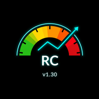

# RiskCockpit — Prop-Firm Risk-Monitoring Dashboard (MetaTrader 5)

**RiskCockpit** is a real-time, rule-monitoring dashboard for prop-firm traders. It watches your risk against the funding program's rules *while you trade* — so you don't blow a challenge on a careless click.

> **It is an advisor, not an autotrader.** RiskCockpit never opens, closes, or modifies a trade. Every decision stays in your hands — it only measures, warns, and displays.

<p align="center"></p>

## Features

- **Live risk read-out** — current exposure, open risk, and distance to your daily and overall loss limits, updated tick-by-tick.
- **Prop-firm rule profiles** — built-in challenge catalog (FundedNext Stellar 1-Step / 2-Step / Lite / Instant), and compatible with FTMO, E8, The5ers, MyFundedFX-style rules.
- **Lot sizer** — computes position size from your risk-per-trade and stop distance, capped to keep a survival margin.
- **Drawdown guards** — daily loss and max drawdown tracking, including the *trailing floor* of instant-funding accounts, with clear on-chart warnings.
- **News windows** — ForexFactory-aligned classification of restricted events, with the countdown to the next binding one.
- **Discipline tools** — tilt detection, cooldown, and a two-click self-lock you cannot undo before it expires.
- **Optional Telegram alerts** — you supply your own bot token (nothing is hard-coded).
- **Multi-language UI** — EN / FR / ES.

## The interface (v3)

The old fixed panel is gone. What stays on the chart is a **36 px rail** glued
to the right edge — one cell per domain (limits, positions, lot, news,
discipline, account, settings, help), each showing a live micro-state. Click a
cell and a **340 px panel** opens in front of it; click it again and it closes.
A chevron stacks every section into a full sidebar.

A small **floating table** shows your open positions with their P&L, age and
missing-stop flag, plus a quick-access strip (room to the nearest limit,
advised lot, next news). It is draggable and can be hidden with its cross —
the POS rail cell brings it back.

Everything is painted on canvas and hit-tested by coordinates: there is not a
single native button on the chart.

## Install

1. Copy `Indicators/RiskCockpit.mq5` → `<MT5>/MQL5/Indicators/`
2. Copy `Libraries/*.mqh` → `<MT5>/MQL5/Libraries/`
3. Copy `Services/RCNewsFeeder.mq5` → `<MT5>/MQL5/Services/`
4. In MetaEditor, compile both (**F7**, 0 errors).
5. Attach the indicator to a chart. In *Navigator → Services*, right-click
   **RCNewsFeeder → Add service**, then allow
   `https://nfs.faireconomy.media` in *Tools → Options → Expert Advisors →
   Allow WebRequest for listed URL*.

**Why a separate service?** MetaTrader forbids `WebRequest` inside an
indicator — it always fails, whitelisted or not. The service fetches the
ForexFactory calendar hourly and writes it to `MQL5/Files/`, and the indicator
reads that file. Skip step 3 and the news rules silently fall back to the MT5
built-in calendar, which classifies events differently from FundedNext.

The compiled `RiskCockpit.ex5` in `Indicators/` matches the version in
[HISTORY.md](HISTORY.md) and is refreshed with every release.

## Availability

Published **free** on the MQL5 Market. More at **[javadrazavi.fr](https://javadrazavi.fr)**.

## Checks

Eleven static checks answer what the MQL5 compiler cannot: a click zone nobody
handles, a label that can never be translated, a setting that no longer does
anything, a personal account number left in a public file. None of those break
a build.

```
python tools/audit.py           # one command, one verdict (exit 0 / 1)
python tools/gate_selftest.py   # proves the gate can still say NO
```

Those are static. The **math** is exercised inside MetaTrader itself: attach
`Scripts/RC_SelfTest.mq5` to any chart — it needs no account, touches nothing,
and writes one line per case to the Experts journal. It includes the very
`RC_Math.mqh` the indicator includes, so it tests the code that ships rather
than a copy of it: the trailing floor at which a funded account is lost, the
80 % / 100 % status thresholds, the cycle dates and the news timestamps.

The self-test injects one defect at a time into a throw-away copy and requires
the matching line to turn FAIL — an audit nobody ever saw fail is a decoration.
Checks that read a binary run a positive control first: if the instrument
cannot see a value the file is known to contain, the check reports UNKNOWN
rather than "clean".

## Author

**Javad Razavi** — *The Solution Maker* · [javadrazavi.fr](https://javadrazavi.fr)

## License

Source-available for reference and evaluation only — see [LICENSE](LICENSE). Not for reuse, redistribution, or resale without written permission.
